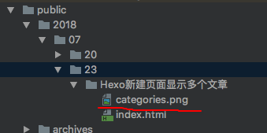

### 配置categories
**1.生成post(文章)时默认生成categories配置项：在根目录下scaffolds/post.md中，
添加一行categories:。同理可应用在page.md和photo.md，示例如下：**
    
    ---
    title: {{ title }}
    date: {{ date }}
    tags: ['标签1','标签2']
    categories: ['前端']
    comments: false    // 是否开启评论
    img:               // 自定义缩略图
    ---

**2.在实际写作时，在开头进行categories配置。例如：**

    ---
    title: Hexo新建页面显示多个文章
    tags:
      - 标签1
      - 标签2
    categories:
      - 前端
    comments: false    // 是否开启评论
    img: // 自定义缩略图
    date: 2018-07-23 18:58:48
    ---
    
这样在文章发布时，在git中使用hexo g命令，hexo会在根目录/public/categrises下自动生成归档文件夹，如图：

   
   
**3.配置博客首页归档展示样式。在主题配置文件themes/_config.yml中添加以下代码:**

    menu:
    - page: home
      url: /
      icon: fa-home
    - page: 前端
      url: /categories/前端
      icon:
    - page: 后端
      url: /categories/后端
      icon:
    - page: 工具
      url: /categories/工具
      icon:
    - page: 分类
      url: /category/
      icon:
    - page: 时间轴
      url: /archives/
      icon:
### 补充说明
**如果发现博客首页展示文本为英文，需要改为中文显示，需要修改先博客根目录下的_config.yml文件的language配置，示例如下：**

    # Site
    title: 借我一支烟
    subtitle: 个人博客
    description:
    keywords:
    author: Lin
    language: zh-CN
    timezone:
然后为实现文章归档名称显示为中文，接着再修改主题配置文件下language/zh-CN.yml即可，示例如下：

    read_more: 阅读全文
    home: 首页
    about: 关于我
    archives: 归档

### 引用本地图片不显示
 究其原因，是图片路径出现问题。
 Hexo图片引用有他的方式，部署以后，图片会自动添加日期相关的文件结构目录。
 #####  解决方法
 _config.yml 文件中设置 post_asset_folder: true，开启资源文件夹功能，该功能支持用户通过相对路径标签引用资源。
执行 hexo new [layout] <title> 创建一篇新的文章，会发现 source/_posts 下自动生成了一个和 md 文件同名的目录（也可以自己手动创建），
这就是用于存放与文章有关的图片文件夹。如下图：

部署之后同目录出现

需要注意的是，使用该种方式在 markdown 文件中引用图片将不再使用 markdown 语法，而是使用标签插件引用相对路径，否则可能造成图片和其他资源显示不正确。引用语法如下：

    
    
    
在上述语法下，插入图片的方法：

    
查看页面，发现图片已经可以正常显示了，图片的路径和实际存放目录是一致的。
如果想使用 markdown 语法插入相对路径的图片，可以利用插件。设置 post_asset_folder:true 后，在根目录下执行：

    npm install https://github.com/CodeFalling/hexo-asset-image --save
确保在 source/_posts 下创建和 markdown 文件同名的目录，里面存放需要的图片，然后在 markdown 中插入图片：
 
    ! [hexo image] (hexo/image.png)
生成的页面中图片引用路径

    
至此，用 markdown 完美实现本地图片插入。
