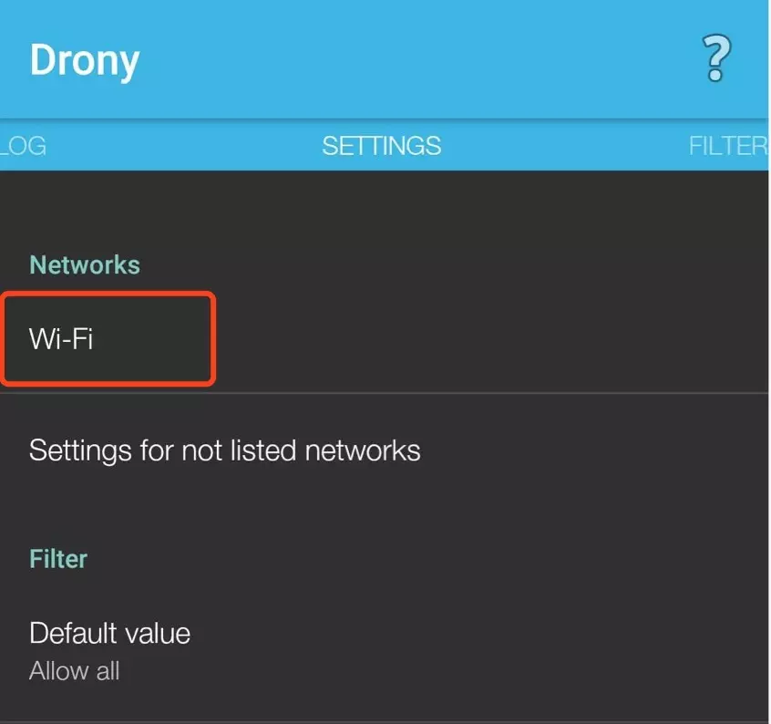
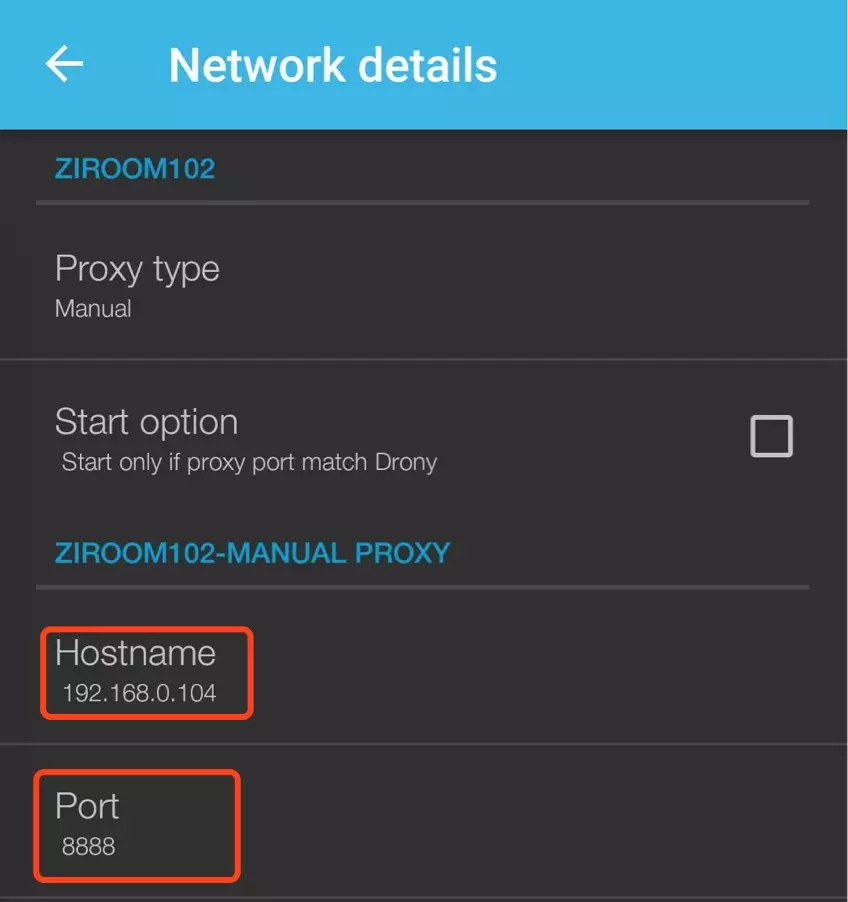
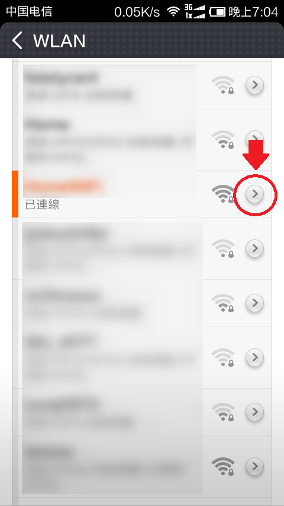
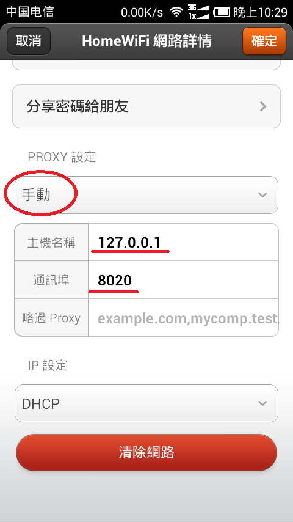

### 设备环境
charles版本4.0.1

小米6 android 8.0.0

### 安装证书
1. 按照Charles的提示，手机打开 chls.pro/ssl
2. 小米通过UC浏览器下载得到一个 charles-proxy-ssl-proxying-certificate.pem 证书
3. 设置 > 更多设置(系统和设备) > 系统安全 > 安装位置应用>文件管理

注：小米通过自带浏览器（QQ浏览器或者其它浏览器未测）下载得到一个 getssl.crt 证书，安装不成功

### charles监听安卓websocket
3.11版本之后，开始支持websocket抓取，
不知道什么原因，使用上面wifi代理配置，无法抓取到websocket请求，查了很多文章都没有成功，最后，看到一句话：有些协议不会经过wifi代理，

于是借助drony，设置步骤：
进入setting选项卡，选择Wi-Fi：

找到使用的网络名，点进去设置，设置为charles的地址地址和端口：

修改系統代理設定
WIFI代理設定, 進入你連接的WIFI網絡的內容:

