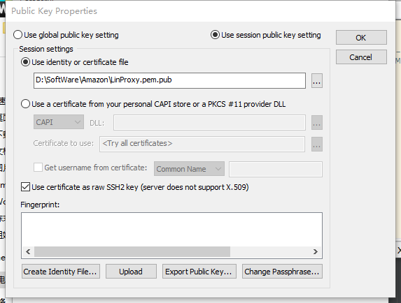
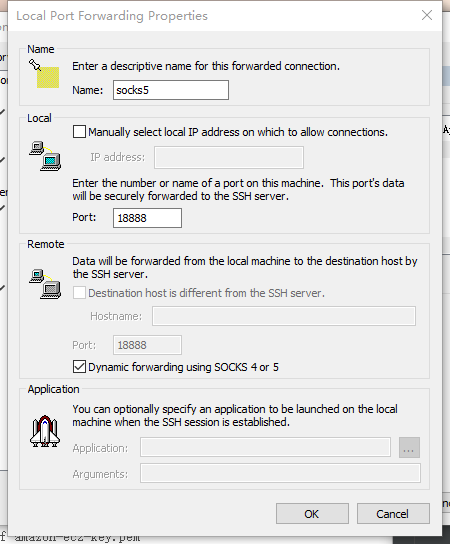
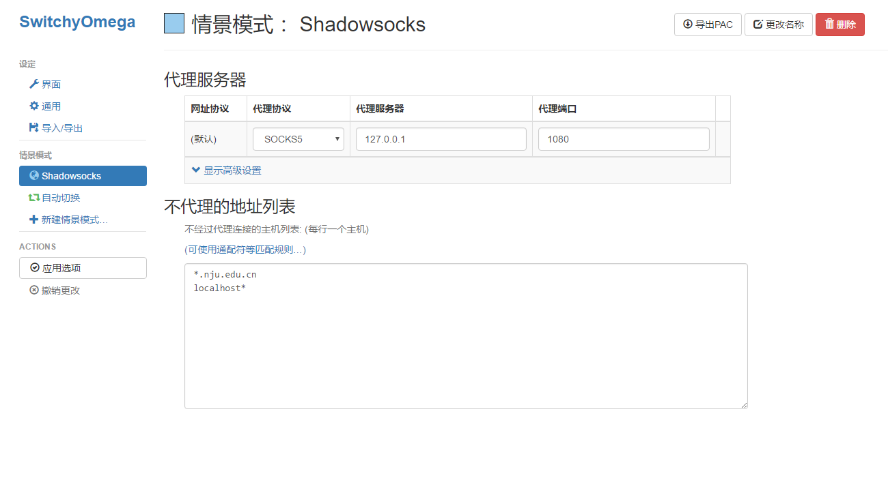
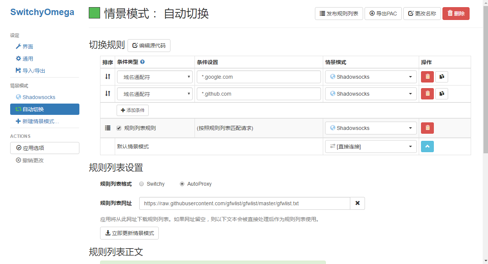

### 所需工具
- 亚马逊服务器
- securecrt
- SwitchyOmega

### 注册激活
网上搜'[亚马逊服务器注册激活](https://blog.csdn.net/awschina/article/details/17149515)'，教程很多。

### 亚马逊主机
亚马逊开通了AWS云服务，可以通过申请亚马逊aws试用资格享受12个月免费主机试用资格。不过要注意日期，超过12个月之后就要收费了，到时候再考虑其他渠道，比如阿里云。。

1. 创建实例
   打开[亚马逊aws云服务](https://amazonaws-china.com/cn/about-aws/select-regions/?sc_channel=PS&sc_campaign=acquisition_CN&sc_publisher=baidu&sc_medium=bz&sc_content=pc&sc_detail=HL&sc_category=pc&sc_segment=test&sc_country=CN&trkCampaign=request_for_pilot_account&trk=baidu-ppc-test)，自己注册，注册方法自行百度，注意区域选择离中国近的地区
2. 进入【EC2】> 云虚拟服务器，在出现的页面点击创建实例：【启动实例】---选择免费实例
3. 进入Amazon系统映像，选择linux版本、64位
4. 进入实例套餐（选择免费类型），点击启动实例
5. 创建密钥对，一定下载保存
6. 启动实例

### SecureCRT访问Amazon EC2主机
1. 上传xxx.pem文件到一个linux系统下，修改其权限为600,。命令 chmod 600 xxx.pem

2. 改写密钥格式为 OpenSSH，命令 ssh-keygen -p -f xxx.pem（如果询问passphrase直接回车）

3. 生成公密钥 .pub 文件 命令 ssh-keygen -e -f xxx.pem > xxx.pem.pub

4. 在SecureCRT中新建连接，协议选择ssh2 ，主机名填写public dns（这个地址EC2的控制台中会提供），用户名填写ec2-user 。

5. 右键点击属性，选中'SSH2',再选择鉴权（Authentication）中的公钥（PublicKey），选中之后右边的属性（Properties）才可选择，点击属性（Properties），选中3生成的共钥，确认即可。
如图：
注：公钥和密钥在同一个目录下。

6. 右键属性，选择‘端口转发(Por Forwarding)’--‘添加(Add)’，名字(Name)填‘socks5’,端口自定义（比如1888），然后勾选上‘Dynamic forwarding using SOCKS 4 or 5'.
如图：

7. 在SecureCRT连接的列表中找到刚创建的连接，右键属性，左边树中选择PortForwarding,点击添加，name填socks5,Port自定义，比如1888
   
### 配置SwitchyOmega

#### 下载安装
点击 [Github-SwitchyOmega](https://github.com/FelisCatus/SwitchyOmega/releases)，下载页面有详细的安装教程，仔细看一下就好。；

#### 配置 Shadowsocks 情景模式
1. 打开 Chrome， 点击右上角的  图标，再点击 **选项**。
2. 点击左侧的 新建情景模式，输入情景模式名称 Shadowsocks【自己任意设置名称】，类型选择第一个代理服务器。创建完成后做如下配置：

注：代理端口是上一项第（6）条填的端口号
3. 保存后你就可以通过这个情景模式科学上网了

#### 配置自动切换模式
点击左侧的 自动切换，或者自己新建情景模式，类型选择第二个 自动切换模式。然后做如下配置：

- 切换规则 是在访问 条件设置 的域名时候使用后面设置的 情景模式。比如图中我设置 *.google.com 和 *.github.com 使用 Shadowsocks 情景模式【刚刚创建的那个情景模式】。我们可以点击 添加条件 来添加自己的规则。
遇到资源未加载的情况时，点击添加条件，即是添加切换规则

- 将图中 规则列表规则 前面的框打√，再将后面的 情景模式 设置为 Shadowsocks，意思是规则列表中的内容，我们使用 Shadowsocks 情景模式。然后 规则列表设置 中：
    
        规则列表格式： AutoProxy；
        规则列表网址：https://raw.githubusercontent.com/gfwlist/gfwlist/master/gfwlist.txt
-这样设置完成 规则列表规则 后就不需要在切换规则中一个一个添加条件了。

### openwrt翻墙

利用openwrt可打造一台翻墙路由器，也可搭建一台翻墙虚拟机
